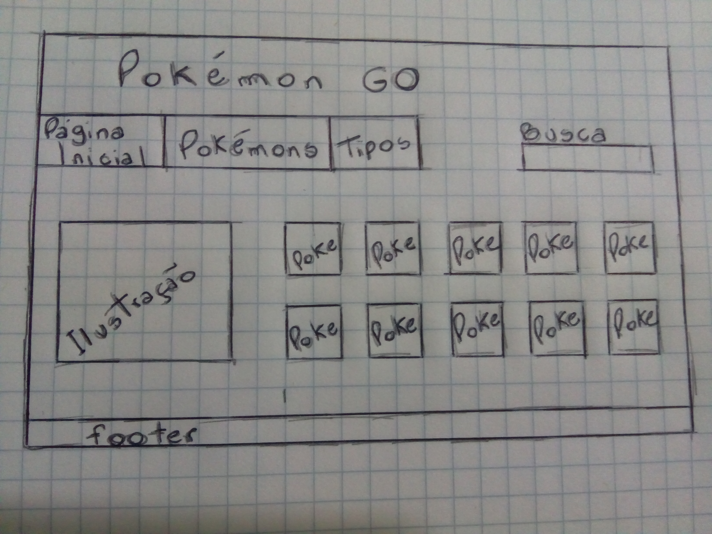
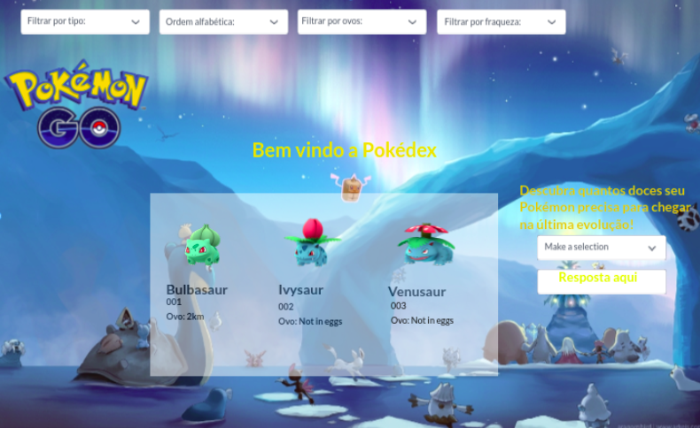

# Data Lovers

## Índice

* [1. Data Lovers](#1-data-lovers)
* [2. Resumo do projeto](#2-resumo-do-projeto)
* [3. Objetivos](#3-objetivos)
* [4. Checklist](#4-checklist)

***

## 1. Data Lovers
Segundo projeto desenvolvido para o Bootcamp Laboratória - SP, Brasil
## 2. Resumo do projeto

Neste projeto construimos uma página web com o tema Pokemón onde é possível visualizar um conjunto de dados 
que se adeque às necessidades de seu usuário.

Permitindo também, filtrá-los, ordená-los e fazer um cálculo.
É um site focado nos jogadores do Pokémon GO, onde possibilita filtragem por tipo, fraquezas e por ovos.

## 3. Objetivos

O objetivo da aplicação é oferecer uma interface intuitiva e divertida que proporcione ao usuário uma ferramenta de pesquisa e consulta e traga informações relevantes sobre os Pokémons para melhor performance no game Pokemon GO.

### Histórias de usuário

Primeiro Sprint: Como jogadora de Pokémon, desejo ter acesso a uma página com as informações de todos os 151 pokémons. Segundo Sprint: Quero ver as caracteristicas dos pokémons para saber quais pokémons tem vantagens sobre outros. Terceira Sprint:Desejo saber quantos doces preciso para evoluir meus pokémons para me planejar melhor.

Quero visualizar principais informações e imagens dos 151 pokémons. Quero ter opções de visualização por tipo, fraqueza e tipo de ovos. Que a cada pokémon consultado eu possa visualizar o valor que eu preciso conseguir de doces para alcançar a última evolução.

### Desenho de interface do usuário
#### Protótipo de baixa fidelidade

#### Testes de usabilidade
Filtros não filtram simultaneamente.

### Implementação da interface de usuário (HTML/CSS/JS)

## 4. Checklist

* [x] Usar VanillaJS.
* [x] Não utilizar `this`.
* [x] Passa pelo linter (`npm run pretest`)
* [x] Passa pelos testes (`npm test`)
* [x] Testes unitários cobrem um mínimo de 70% de statements, functions,
  lines e branches.
* [x] Inclui uma _definição de produto_ clara e informativa no `README.md`.
* [x] Inclui histórias de usuário no `README.md`.
* [x] Inclui rascunho da solução (protótipo de baixa fidelidade) no
  `README.md`.
* [x] Inclui uma lista de problemas detectados nos testes de usabilidade no `README.md`.
* [x] UI: Mostra lista/tabela/etc com dados e/ou indicadores.
* [x] UI: Permite ordenar dados por um ou mais campos (asc e desc).
* [x] UI: Permite filtrar dados com base em uma condição.
* [x] UI: É _responsivo_.
